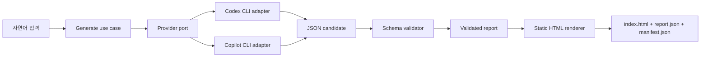

# Report-Gen v1 Architecture

- 상태: v1 구현 기준
- 최종 수정: 2026-09-01
- 관련 결정: [ADR-0001](adr/0001-v1-runtime-and-boundaries.md)
- 제품 계약: [`AGENTS.md`](../AGENTS.md)
- 디자인 계약: [`DESIGN.md`](../DESIGN.md)

## 1. 목표와 범위

Report-Gen v1은 자연어 데이터를 하나의 LLM Provider로 분석하고, Provider와 무관한 구조화 보고서로 검증한 뒤, 정적 Renderer로 borderless HTML 보고서를 생성한다.

v1의 지원 범위는 다음과 같다.

- 인증된 Codex CLI 또는 GitHub Copilot CLI 중 하나를 실행한다.
- 두 Provider가 같은 JSON Schema 계약을 만족하도록 정규화한다.
- 검증된 구조화 데이터에서 self-contained `index.html`을 생성한다.
- 같은 구조화 데이터와 디자인 버전은 바이트 단위로 같은 HTML을 생성한다.
- A4와 Slide는 확장 지점만 보존하고 구현하지 않는다.

## 2. 기술 기준선

- Runtime: Node.js 22 이상
- Language: TypeScript, strict mode, ESM
- Package manager: npm과 lockfile
- Schema: JSON Schema를 단일 원본으로 사용하고 Ajv로 런타임 검증
- Unit/contract tests: Node.js test runner 또는 동등한 최소 TypeScript 실행 계층
- Browser verification: Playwright
- CLI argument parsing: 가능한 범위에서 Node.js 표준 라이브러리 사용

런타임 의존성은 구조화 검증처럼 직접 구현할 때 오류 가능성이 큰 기능에만 추가한다. UI 프레임워크와 웹 서버는 v1 정적 출력에 필요하지 않다.

## 3. 시스템 경계



의존 방향은 항상 바깥에서 안쪽으로 향한다.

- `domain`: 구조화 보고서 계약과 오류 타입. CLI나 파일시스템을 알지 못한다.
- `application`: 생성 순서와 포트를 정의한다. 특정 Provider 명령이나 HTML 세부 구현을 알지 못한다.
- `providers`: 외부 CLI 실행과 최종 응답 추출만 담당한다.
- `renderers/html`: 검증된 보고서를 정적 HTML로 변환한다.
- `cli`: 인수, stdin/stdout, 파일 입출력과 종료 코드를 연결한다.

Provider가 HTML을 생성하거나 Renderer가 LLM을 다시 호출하는 경로는 허용하지 않는다.

## 4. 계획된 저장소 구조

```text
src/
  application/
  cli/
  domain/
    report.schema.json
  providers/
    codex/
    copilot/
  renderers/
    html/
tests/
  contract/
  fixtures/
  integration/
  visual/
docs/
  adr/
```

실제 구현에서 더 깊은 경계가 필요할 때만 하위 디렉터리를 추가한다. 파일 수를 늘리기 위한 얕은 래퍼는 만들지 않는다.

## 5. 구조화 보고서 계약

정확한 필드와 제한은 `report.schema.json`에서 정의한다. 최상위 의미 구조는 다음 순서를 고정한다.

1. 보고서 메타데이터
2. Executive summary
3. Key metrics
4. Analysis sections
5. Conclusion and actions
6. Sources

계약에는 다음 원칙을 적용한다.

- 명시적인 `schemaVersion`을 둔다.
- 필수 섹션, 배열 순서와 허용 블록 종류를 고정한다.
- 문자열, 배열, 표와 차트 데이터에 현실적인 최대 크기를 둔다.
- 알 수 없는 속성은 거부한다.
- HTML, Markdown 실행 구문이나 CSS를 콘텐츠 필드로 받지 않는다.
- 날짜, ID와 정렬 순서는 Renderer가 임의 생성하지 않고 입력 계약에서 결정한다.
- Provider별 부가 데이터는 공통 보고서에 섞지 않는다.

Provider 응답은 JSON 추출 후 항상 같은 Validator를 통과한다. Schema 불일치는 사용자 입력 오류와 구분된 안정적인 오류로 반환하며, v1은 자동 LLM 수정 호출을 하지 않는다.

## 6. Provider 실행 계약

공통 `Provider` 포트는 자연어 입력, 프롬프트 버전과 Schema 위치를 받아 JSON 후보 문자열과 최소 실행 메타데이터를 반환한다.

두 어댑터는 다음 불변 조건을 지킨다.

- 기존 CLI 인증 세션만 사용하고 별도 API 키 입력을 요구하지 않는다.
- 명령은 shell을 거치지 않고 실행 파일과 인수 배열로 시작한다.
- 프롬프트와 사용자 입력은 가능한 경우 stdin으로 전달한다.
- 실행 시간, stdout/stderr 바이트와 최종 응답 크기에 제한을 둔다.
- 취소나 시간 초과 시 자식 프로세스 트리를 종료한다.
- 토큰, 인증 경로와 원문 입력을 기본 로그에 기록하지 않는다.
- 종료 코드, timeout, 실행 파일 부재, 인증 실패와 Schema 실패를 구분한다.
- 사용자 전역 설정, 저장소 지침과 도구 실행이 분석 결과를 바꾸지 않도록 격리한다.

### Codex CLI

Codex 어댑터는 비대화형 `codex exec`를 사용한다. 구현 시 `--output-schema`, `--output-last-message`, `--ephemeral`, `--sandbox read-only`, `--ignore-user-config`와 격리된 작업 디렉터리를 검증한다. 최종 응답 파일만 JSON 후보로 읽고 이벤트 출력은 진단 정보로 취급한다.

### GitHub Copilot CLI

Copilot 어댑터는 비대화형 prompt mode와 `--silent`, `--no-ask-user`, `--no-custom-instructions`, `--disable-builtin-mcps`를 사용한다. 사용 가능한 도구를 최소 집합으로 먼저 제한하며 shell, write, web, delegation과 MCP 도구를 노출하지 않는다. Copilot CLI에는 Codex의 `--output-schema`와 같은 강제 옵션이 없으므로 최종 텍스트를 추출한 뒤 공통 Validator에서 거부 또는 승인한다.

정확한 인수 조합은 각 Provider contract test에서 설치된 지원 버전에 대해 고정한다. `--allow-all`이나 `--yolo`는 사용하지 않는다.

## 7. 정적 HTML Renderer

Renderer의 입력은 검증이 완료된 보고서와 명시적인 디자인 버전뿐이다.

- `DESIGN.md`의 색상, 타이포그래피, 고정 구조와 overflow 규칙을 구현한다.
- CSS와 필요한 SVG는 HTML에 포함하며 런타임 네트워크 요청을 만들지 않는다.
- 사용자 및 LLM 문자열은 HTML 문맥에 맞게 escape한다.
- URL은 허용된 프로토콜만 링크로 만든다.
- 데이터 기반 고정 ID를 사용하고 시간, 난수, 호스트 경로를 출력에 넣지 않는다.
- 본문 정보에 고정 높이, line clamp, ellipsis 또는 숨김 overflow를 적용하지 않는다.
- 표와 본질적으로 넓은 데이터만 로컬 스크롤 컨테이너를 사용할 수 있다.

출력 디렉터리는 다음 세 파일을 원자적으로 교체한다.

- `index.html`: 최종 보고서
- `report.json`: 검증된 정규형 데이터
- `manifest.json`: Schema와 디자인 버전, 선택한 Provider, 파일 무결성 정보

Provider 이름처럼 렌더링 의미가 없는 실행 메타데이터는 HTML 바이트 결정에 사용하지 않는다.

## 8. CLI 사용자 흐름

계획된 기본 명령은 다음 의미를 가진다.

```text
report-gen generate --provider <codex|copilot> --input <path|-> --output <directory>
report-gen validate --input <report.json>
report-gen render --input <report.json> --output <directory>
report-gen doctor
```

- `generate`: Provider 실행, 검증, 렌더링을 연결한다.
- `validate`: LLM 호출 없이 구조화 데이터를 검사한다.
- `render`: LLM 호출 없이 결정적으로 결과물을 다시 만든다.
- `doctor`: 런타임, CLI 설치와 인증 가능성을 민감 정보 없이 진단한다.

명령 이름과 인수는 CLI 구현 Issue에서 고정하며, 라이브 Provider 호출 전에 출력 경로와 비용 발생 가능성을 사용자에게 명확히 알린다.

## 9. 오류와 안전

오류는 사람이 읽을 수 있는 메시지와 안정적인 코드로 표현한다.

- 사용법 또는 입력 오류
- Provider 실행 파일 부재
- Provider 인증 실패
- Provider timeout 또는 비정상 종료
- 응답 추출 실패
- Schema 검증 실패
- 출력 경로 또는 쓰기 실패
- Renderer 내부 불변 조건 실패

부분 생성물은 성공 결과처럼 남기지 않는다. 임시 디렉터리에 모두 생성하고 검증한 뒤 목적 경로로 이동한다. 기존 출력 덮어쓰기 정책은 CLI에서 명시하며 조용히 데이터가 사라지는 동작을 금지한다.

## 10. 검증 전략

### 자동 검사

- Schema의 정상, 누락, 추가 속성, 최대 길이와 경계값 테스트
- Provider 명령 구성과 오류 매핑 unit test
- 가짜 실행 파일을 사용한 두 Provider contract test
- Renderer snapshot과 동일 입력 결정성 테스트
- HTML escape, URL scheme, CSP와 원격 자산 부재 테스트
- 320px reflow, 200% zoom, keyboard focus와 WCAG AA 대비 검사
- 긴 한국어·영어·다국어·공백 없는 문자열, 대형 표와 빈 섹션 fixture

### 라이브 검사

실제 크레딧과 인증을 사용하는 검사는 기본 test suite와 분리한다. 동일한 대표 입력을 두 CLI에 보내고 다음을 비교한다.

- 공통 Schema 통과
- 필수 섹션 보존
- Renderer 성공
- 민감 정보 없는 오류 처리

두 Provider의 문장이나 수치가 동일할 필요는 없지만 구조 계약과 렌더링 품질 기준은 동일해야 한다.

## 11. 확장 규칙

A4 또는 Slide 지원 시 새 Renderer가 같은 검증된 보고서 계약을 소비하도록 추가한다. 기존 HTML 계약을 약화하거나 Provider별 구조를 만들지 않는다. 형식별 표현 차이가 공통 Schema에 영향을 줄 경우 별도 ADR과 Schema version 변경이 필요하다.

## 12. 참고 자료

- [OpenAI Codex CLI command reference](https://developers.openai.com/codex/cli/reference/)
- [GitHub Copilot CLI programmatic usage](https://docs.github.com/en/copilot/how-tos/copilot-cli/automate-copilot-cli/run-cli-programmatically)
- [GitHub Copilot CLI command reference](https://docs.github.com/en/copilot/reference/copilot-cli-reference/cli-command-reference)
- [GitHub Copilot CLI tool permissions](https://docs.github.com/en/copilot/how-tos/copilot-cli/use-copilot-cli/allowing-tools)
