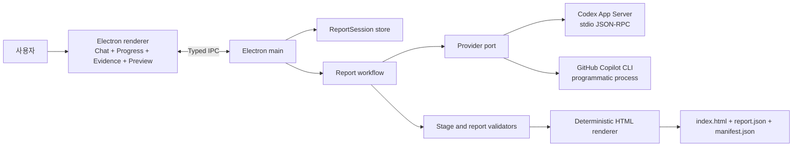

# Report-Gen v1 Architecture

- 상태: v1 구현 기준
- 최종 수정: 2026-09-01
- 관련 결정: [ADR-0002](adr/0002-desktop-report-application-and-provider-runtimes.md)
- 제품 계약: [`AGENTS.md`](../AGENTS.md)
- 보고서 디자인 계약: [`DESIGN.md`](../DESIGN.md)

## 1. 제품 정의와 범위

Report-Gen v1은 범용 AI 채팅이나 CLI 사용이 어려운 사람을 위한 로컬 데스크톱 보고서 생성기다. 사용자는 보고서 중심의 채팅 UI에서 자연어 요청과 자료를 제출하고, 애플리케이션은 요청 정제, 근거 보완, 내용 작성, 검토, 구조 검증과 정적 렌더링을 조정한다.

CLI는 사용자 인터페이스가 아니다. Codex CLI와 GitHub Copilot CLI는 사용자가 이미 보유한 Provider 계정과 인증을 재사용하는 로컬 Agent runtime이다.

v1의 제품 계약은 다음과 같다.

- Codex와 GitHub Copilot의 기존 인증 또는 공식 대화형 로그인을 지원한다.
- API Key, BYOK, token 입력과 Report-Gen 전용 계정을 지원하지 않는다.
- 애플리케이션이 Provider-neutral 보고서 세션과 워크플로 상태를 소유한다.
- LLM 단계의 결과를 JSON Schema로 검증하고, 최종 `ReportDocument`에서 borderless HTML을 정적으로 생성한다.
- 같은 유효한 `ReportDocument`와 디자인 버전은 바이트 단위로 같은 HTML을 생성한다.
- A4, Slide, 협업 백엔드와 클라우드 동기화는 v1 범위가 아니다.

## 2. 기술 기준선

- Desktop shell: Electron
- Runtime: Node.js 22 이상
- Language: TypeScript strict mode, ESM
- Package manager: npm과 lockfile
- Renderer security: context isolation 활성화, Node integration 비활성화
- Process IPC: preload에서 노출한 좁고 타입이 지정된 request/event 계약
- Schema: JSON Schema 단일 원본과 Ajv 런타임 검증
- Unit/contract tests: Node.js test runner 또는 동등한 최소 TypeScript 실행 계층
- Desktop/report E2E와 시각 검증: Playwright

화면 프레임워크와 로컬 저장 구현체는 구현 전 별도 결정으로 고정할 수 있다. 이 선택은 아래 process, IPC, domain, Provider와 Renderer 경계를 바꾸지 않아야 한다.

## 3. 시스템 경계



의존 방향은 외부 런타임과 UI에서 애플리케이션 계약을 거쳐 domain으로 향한다.

- `domain`: 보고서 세션, workflow state, stage Schema, `ReportDocument`, 오류와 capability 타입
- `application`: use case, 상태 전이, Provider routing, 재시도·취소, 검증과 게시 순서
- `providers`: Codex App Server 및 Copilot CLI 프로토콜을 공통 포트로 변환
- `agent-package`: 보고서 지침, 근거 정책, Provider별 Skill·agent·Hook projection
- `renderers/html`: 검증된 `ReportDocument`를 self-contained HTML로 변환
- `desktop/main`: process 수명주기, IPC, 인증 조정, 로컬 저장과 파일 대화상자
- `desktop/renderer`: 화면 상태와 사용자 상호작용; privileged API에 직접 접근하지 않음

Provider가 HTML을 생성하거나, renderer UI가 Provider 프로세스 및 credential에 직접 접근하거나, HTML Renderer가 LLM을 다시 호출하는 경로는 허용하지 않는다.

## 4. 사용자 경험과 화면 책임

기본 화면은 채팅과 보고서 작업 상태를 함께 보여준다.

- Chat: 자연어 요청, 후속 답변, 파일 첨부와 수정 지시
- Progress: 요청 분석, 정보 보완, 근거 수집, 작성, 검토와 렌더링 단계
- Evidence: 출처, 어떤 주장에 사용되었는지, 누락 또는 검증 경고
- Preview: 검증된 결과로 만든 HTML 보고서
- Provider status: 연결 여부와 재로그인 동작; token이나 내부 CLI 출력은 표시하지 않음

Agent의 원시 이벤트와 reasoning을 그대로 노출하지 않는다. 애플리케이션이 안전한 사용자용 progress event와 질문, 승인 요청, 결과로 변환한다.

`DESIGN.md`는 생성된 HTML 보고서의 시각 계약이다. 데스크톱 shell은 LG 브랜드 토큰과 접근성 원칙을 재사용할 수 있지만, 보고서의 고정 구조와 레이아웃 규칙을 앱 화면에 그대로 적용하지 않는다. 데스크톱 UI 구현 전에 별도 UI 계약이 필요하다면 독립 문서로 추가한다.

## 5. ReportSession과 워크플로

`ReportSession`은 애플리케이션이 소유하는 제품 상태다.

```text
created
  -> evaluating-request
  -> awaiting-user-input | refining-prompt
  -> collecting-evidence
  -> composing
  -> reviewing
  -> rendering
  -> completed

모든 실행 상태 -> failed | cancelled
```

단계의 의미는 다음과 같다.

1. `evaluating-request`: 목적, 독자, 범위, 형식, 제공 자료와 부족한 정보를 평가한다.
2. `refining-prompt`: 사용자의 의도를 보존한 정규형 `ReportBrief`를 만든다.
3. `collecting-evidence`: 필요한 경우 웹 또는 제출 자료에서 근거를 수집하고 주장과 출처를 연결한다.
4. `composing`: `ReportBrief`와 근거에서 `ReportDocument` 후보를 만든다.
5. `reviewing`: 사실 근거, 누락, 일관성, 금지 콘텐츠와 Schema 준수를 독립적으로 검토한다.
6. `rendering`: 승인된 `ReportDocument`를 검증하고 정적 HTML 산출물을 게시한다.

각 LLM 단계는 입력, 출력, prompt version, Provider 실행 참조와 상태를 기록한다. Reviewer가 수정을 요구할 때는 제한된 전이로 composition 또는 evidence 단계에 돌아갈 수 있다. 무한 반복을 막기 위해 재시도 및 review cycle 상한을 애플리케이션 정책으로 둔다.

역할은 독립적인 Agent turn으로 실행한다. Provider routing policy는 사용 가능한 인증과 capability에 따라 역할을 Codex 또는 Copilot에 배정할 수 있다. 같은 Provider를 사용하더라도 작성과 검토의 context 및 출력 계약은 분리한다.

## 6. 구조화 계약

JSON Schema는 모든 LLM 단계와 최종 보고서의 단일 원본이다.

주요 계약은 다음과 같다.

- `RequestAssessment`: 품질 점검, 명시된 요구, 누락 정보와 사용자 질문
- `ReportBrief`: 목적, 독자, 범위, 언어, 필수 주제, 근거 요구와 성공 조건
- `EvidenceBundle`: source metadata, claim linkage, 신뢰도와 미해결 gap
- `ReportDocument`: 최종 보고서 의미 구조와 콘텐츠
- `ReviewResult`: 통과 여부, issue code, 수정 대상과 근거

`ReportDocument`의 최상위 의미 구조는 다음 순서를 고정한다.

1. 보고서 메타데이터
2. Executive summary
3. Key metrics
4. Analysis sections
5. Conclusion and actions
6. Sources

모든 계약은 다음 원칙을 지킨다.

- 명시적인 `schemaVersion`과 prompt version을 둔다.
- 알 수 없는 속성을 거부하고 문자열, 배열, 표와 차트 데이터의 최대 크기를 제한한다.
- HTML, CSS, 실행 가능한 Markdown과 임의 스크립트를 콘텐츠 필드로 받지 않는다.
- URL, 날짜, ID, 정렬 순서와 출처 관계를 명시적으로 표현한다.
- Provider별 metadata는 domain 문서에 섞지 않고 실행 기록에 분리한다.
- Provider native structured-output 기능을 사용해도 공통 애플리케이션 Validator를 생략하지 않는다.

검증 실패는 안정적인 오류로 기록한다. 자동 수정은 무제한 자유 대화가 아니라 해당 Schema 오류만 전달하는 제한된 retry로 수행한다.

## 7. Provider 경계와 capability model

공통 `ProviderRuntime`은 Provider의 모든 기능을 추상화하지 않고 보고서 워크플로에 필요한 동작만 제공한다.

```text
inspectInstallation()
readAuthenticationState()
beginInteractiveLogin()
startAgentTurn(request)
cancelAgentTurn(turnId)
observeEvents(turnId)
dispose()
```

각 Provider는 별도 capability 정보를 반환한다. 예시는 native structured output, resumable conversation, fine-grained progress, approval requests, Skill discovery, Hook discovery와 web research다. Application은 필수 capability가 없을 때 명시적 대체 경로를 선택하거나 지원 불가 오류를 반환한다.

공통 불변 조건은 다음과 같다.

- shell command 문자열이 아니라 실행 파일과 인수 배열로 시작한다.
- 사용자 요청과 자료를 command argument에 불필요하게 노출하지 않는다.
- 실행 시간, 출력 크기, 동시 실행 수와 재시도 횟수를 제한한다.
- 취소, timeout과 앱 종료 시 자식 process tree를 정리한다.
- token, credential path, 원문 입력과 민감한 도구 출력을 기본 로그에 남기지 않는다.
- 설치 실패, 인증 실패, 권한 거부, timeout, Provider 오류와 Schema 오류를 구분한다.
- 사용자 전역 customization이 보고서 계약을 우회하지 못하게 app-owned Agent package를 명시적으로 적용하고 최종 결과를 독립 검증한다.

### 7.1 Codex runtime

- Electron main이 `codex app-server`를 stdio JSONL 모드로 시작한다.
- App Server 초기화 후 account 상태, Thread/Turn, streaming event, approval과 interruption을 어댑터로 처리한다.
- 기존 로그인은 자동 재사용하고, 미인증 상태에서는 `account/login/start`의 공식 ChatGPT browser 또는 device-code 흐름을 UI에 연결한다.
- 앱에 번들된 Report Skill root를 세션에 제공하고 관련 turn에서 Skill을 명시적으로 선택한다.
- App Server protocol version과 생성된 type/schema를 지원 Codex 버전에 맞춰 검증한다.

### 7.2 GitHub Copilot runtime

- Electron main이 공식 `copilot` 실행 파일을 programmatic mode로 시작한다.
- 기존 OAuth 인증을 재사용하고, 미인증 상태에서는 공식 `copilot login` device 또는 web flow를 사용자에게 연결한다.
- API Key/BYOK 환경변수나 token 입력은 Report-Gen 인증 방식으로 제공하지 않는다.
- app-owned custom agent와 Skill을 명시적으로 선택하고 Hook projection을 적용한다.
- 세밀한 event나 structured-output 강제가 부족한 경우 어댑터가 결과를 추출한 뒤 공통 Validator로 승인 또는 거부한다.

정확한 명령 인수와 지원 버전은 Provider contract test가 고정한다. 광범위한 자동 승인 옵션은 사용하지 않는다.

## 8. 인증 경계

앱 시작 시 각 Provider에 대해 설치와 인증 상태를 별도로 확인한다.

```text
installed + authenticated -> 즉시 사용 가능
installed + signed out     -> 공식 로그인 버튼 제공
missing                    -> 설치 안내, 다른 Provider 사용 가능
expired or revoked         -> 재로그인 안내
```

- Report-Gen은 password, API Key, OAuth token과 credential cache를 읽거나 IPC로 전달하지 않는다.
- 로그인 URL, device code와 완료 상태처럼 공식 흐름에 필요한 일시 정보만 UI에 전달한다.
- 브라우저 또는 device authorization은 사용자가 직접 승인한다.
- 계정 email이나 plan을 표시할 때는 Provider API가 명시적으로 반환한 최소 정보만 사용한다.
- 로그아웃은 Provider의 공식 동작을 통해 수행하고 다른 앱이 공유하는 세션에 미치는 영향을 먼저 알린다.

## 9. Agent package, Skill과 Hook

제품 동작의 원본은 Provider home directory가 아니라 애플리케이션에 versioned resource로 포함된 Agent package다.

```text
agent-package/
  policy/
    report-workflow.md
    evidence-policy.md
    safety-policy.md
  schemas/
  references/
    DESIGN.md
  codex/
    skills/
    hooks/
  copilot/
    agents/
    skills/
    hooks/
  scripts/
    validate-stage.*
    validate-report.*
```

Provider별 파일 형식은 다를 수 있지만 다음 의미는 일치해야 한다.

- 사용자의 목적과 사실을 임의로 바꾸지 않는다.
- 부족한 핵심 정보는 질문하고, 추측이 허용된 범위를 표시한다.
- 외부 근거는 URL, 제목, 접근 시점과 뒷받침하는 claim을 구조화한다.
- 최종 내용은 지정된 Schema만 출력하고 HTML/CSS를 작성하지 않는다.
- Tool write 범위와 산출물 경로를 앱이 만든 session directory로 제한한다.

Hook은 lifecycle 관찰과 guardrail에만 사용한다.

- prompt submit: 비어 있는 입력, 크기 제한과 민감정보 경고
- pre-tool: 위험 명령과 범위 밖 write를 보조 차단
- post-tool: source/tool metadata와 검증 결과 기록
- stop/session end: 최종 검증 요청과 임시 자원 정리

Hook이 실행되지 않거나 우회 가능한 tool path가 있어도 process 권한, sandbox, approval, Validator가 안전 조건을 유지해야 한다. Hook의 재진입과 무한 stop loop를 금지한다.

## 10. 정적 HTML Renderer와 산출물

Renderer 입력은 검증된 `ReportDocument`와 명시적인 design version뿐이다.

- `DESIGN.md`의 색상, 타이포그래피, 고정 구조, 접근성과 overflow 규칙을 구현한다.
- CSS와 필요한 승인된 SVG를 HTML에 포함하고 런타임 네트워크 요청을 만들지 않는다.
- 사용자 및 LLM 문자열을 HTML 문맥에 맞게 escape한다.
- URL은 허용된 protocol만 링크로 만든다.
- 시간, 난수, host path나 Provider metadata를 HTML 바이트 결정에 사용하지 않는다.
- 본문에 fixed height, line clamp, ellipsis 또는 hidden overflow를 적용하지 않는다.
- 표처럼 본질적으로 넓은 데이터만 local scroll container를 사용할 수 있다.

게시되는 결과 bundle은 다음을 포함한다.

- `index.html`: 최종 self-contained 보고서
- `report.json`: 검증된 `ReportDocument`
- `manifest.json`: Schema, prompt와 design version, 생성 단계와 파일 무결성 정보
- `evidence.json`: 보고서에 사용된 구조화 출처와 claim 연결

Provider 이름과 진단 정보처럼 보고서 표현에 필요 없는 metadata는 `index.html` 결정성에 영향을 주지 않는다.

## 11. 로컬 저장과 파일 경계

애플리케이션 데이터와 사용자가 내보낸 보고서를 분리한다.

- App data: ReportSession, chat message, stage state, Provider reference와 복구 metadata
- Session workspace: 첨부 자료의 app-owned working copy, 중간 결과와 임시 파일
- Export bundle: 사용자가 선택한 위치에 게시한 검증 완료 산출물

원본 첨부 파일을 수정하지 않는다. Session workspace는 앱별 data directory 아래의 resolve된 경로로 제한한다. 게시 시 임시 directory에 전체 bundle을 생성·검증한 후 원자적으로 교체하며, 기존 결과를 덮어쓸 때는 사용자 의사를 확인한다.

Provider 대화 ID만으로 session을 복구하지 않는다. Provider session이 사라져도 완료된 stage output과 artifact는 로컬 domain state에서 열 수 있어야 한다.

## 12. IPC와 보안

renderer에 범용 command 실행, 임의 path read/write 또는 raw Provider RPC를 노출하지 않는다. preload bridge는 제품 use case 단위 API만 제공한다.

```text
session.create
session.open
session.submitMessage
session.answerQuestion
session.cancelCurrentStage
provider.getStatus
provider.beginLogin
report.export
report.openPreview
```

Main에서 모든 IPC payload를 Schema로 다시 검증한다. renderer가 보낸 path, URL, Provider ID와 session ID를 신뢰하지 않는다. 외부 URL은 허용 목록과 사용자 gesture를 확인한 뒤 OS browser에서 열고, report preview에는 restrictive CSP와 navigation 차단을 적용한다.

Approval은 기술적인 raw tool request를 그대로 보여주지 않고 동작, 대상, 위험과 허용 범위를 설명하는 제품 UI로 변환한다. 앱이 대신 승인하거나 광범위한 영구 승인을 기본값으로 제공하지 않는다.

## 13. 오류 모델과 복구

오류는 사람이 읽을 수 있는 메시지, 안정적인 code, retry 가능 여부와 영향을 받은 stage를 가진다.

- 설치 또는 지원 버전 오류
- 인증 필요, 만료 또는 사용자 취소
- Provider 시작, 통신, timeout 또는 비정상 종료
- 사용자 승인 거부
- 입력 및 첨부 파일 오류
- stage output 추출 또는 Schema 검증 실패
- 근거 부족 또는 review 미통과
- 저장, 렌더링 또는 export 실패

완료된 이전 단계는 보존하고 안전한 단계부터 재시작할 수 있게 한다. 단, prompt, Schema, Agent package 또는 source가 변경되면 downstream 결과를 stale로 표시하고 다시 생성한다. 부분 결과를 완성된 보고서처럼 게시하지 않는다.

## 14. 계획된 저장소 구조

```text
src/
  application/
  desktop/
    main/
    preload/
    renderer/
  domain/
    schemas/
  providers/
    codex/
    copilot/
  agent-package/
  renderers/
    html/
  storage/
tests/
  contract/
  fixtures/
  integration/
  e2e/
  visual/
docs/
  adr/
```

실제 구현에서 소유권이나 테스트 경계가 생길 때만 더 깊게 나눈다. Provider projection과 생성된 artifact는 원본 policy 및 Schema와 구분하고 생성 규칙을 문서화한다.

## 15. 검증 전략

### 자동 검사

- 모든 stage Schema의 정상, 누락, 추가 속성, 최대 길이와 경계값
- workflow의 정상 전이, 질문 대기, retry 상한, 취소와 stale invalidation
- fake process와 fixture stream을 사용한 두 Provider contract test
- API Key/BYOK 입력·저장·로그 경로가 없음을 확인하는 auth boundary test
- renderer IPC allowlist, payload validation과 privileged API 비노출 검사
- Renderer snapshot, 동일 입력 결정성과 HTML escape/CSP/원격 자산 부재
- 320px reflow, 200% zoom, keyboard focus와 WCAG AA 대비
- 긴 한국어·영어·다국어·공백 없는 문자열, 대형 표와 빈 section fixture
- 앱 재시작 후 ReportSession 및 완료 artifact 복구

### 라이브 검사

실제 구독과 인증을 사용하는 검사는 기본 test suite와 분리한다.

- 기존 인증 자동 재사용과 signed-out 로그인 흐름
- Codex App Server 초기화, turn streaming, approval, 취소와 종료
- Copilot programmatic 실행, 로그인 필요 감지, 취소와 종료
- 두 Provider의 stage output이 같은 Schema와 Renderer를 통과함
- Provider 또는 앱 종료 후 orphan process와 token log가 남지 않음

두 Provider의 문장과 세밀한 event가 동일할 필요는 없다. 사용자에게 약속한 workflow state, 구조 계약, 오류 의미와 렌더링 품질은 동일해야 한다.

## 16. 확장 규칙

- A4 또는 Slide는 같은 검증된 `ReportDocument`를 소비하는 새 Renderer로 추가한다.
- 새 Provider는 인증 비밀값을 앱이 소유하지 않고 공통 workflow 계약을 충족할 때만 별도 ADR로 추가한다.
- 협업, 원격 실행이나 cloud sync는 로컬 `ReportSession` 소유권과 credential 경계를 다시 검토하는 별도 Architecture 결정이 필요하다.
- Provider native 기능을 추가할 때 공통 제품 계약을 약화하거나 Provider별 `ReportDocument`를 만들지 않는다.

## 17. 참고 자료

- [Codex App Server](https://learn.chatgpt.com/docs/app-server)
- [Codex authentication](https://learn.chatgpt.com/docs/auth)
- [GitHub Copilot CLI authentication](https://docs.github.com/en/copilot/how-tos/copilot-cli/set-up-copilot-cli/authenticate-copilot-cli)
- [GitHub Copilot CLI overview](https://docs.github.com/en/copilot/how-tos/copilot-cli/use-copilot-cli/overview)
- [GitHub Copilot CLI command reference](https://docs.github.com/en/copilot/reference/copilot-cli-reference/cli-command-reference)
- [GitHub Copilot CLI hooks](https://docs.github.com/en/copilot/how-tos/copilot-cli/customize-copilot/use-hooks)
